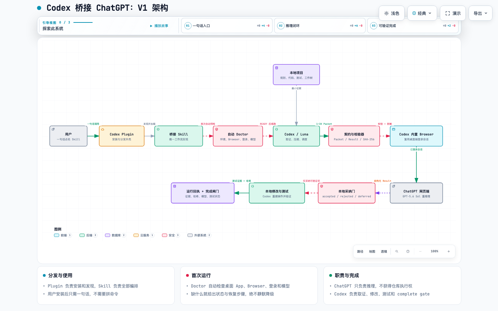

# Codex 桥接 ChatGPT

[English](README.md) | **简体中文**

[](https://github.com/anightmonarch/codex-bridge-chatgpt/actions/workflows/ci.yml)
[](CHANGELOG.md)
[](LICENSE)
[](package.json)

一个开源的 Codex Skill 和 Plugin-ready 项目：固定使用同一个普通 ChatGPT Chat 贯穿规划、写作、文件生成、审查和推理，同时把实时证据、电脑操作、产物采纳、修改和测试留在 Codex 本地。

本分支直接建立在上游提交 `56e36c2feeb6705376c1d1dc50dbec52ea43d4f4` 之上；保留的上游基础与本分支新增功能见 [UPSTREAM.md](UPSTREAM.md)。

```text
$codex-bridge-chatgpt 诊断这个复杂 Bug，完成修复并在本地验证。
```

不需要 OpenAI API Key，也不运行后台服务。桌面 App 能直接协调普通 Chat 时优先使用该能力；只有退回到可见的 ChatGPT 网页自动化时，首次发送前才要求用户明确接受浏览器风险。

> **Unofficial Experimental（非官方实验功能）：** 自动控制 ChatGPT 网页端存在非零账号风险，可能触发安全机制、临时限制或账号处置。本项目与 OpenAI 无关联，也未获得其认可或授权；不能保证合规、账号安全、模型可用性或 ChatGPT/Codex 额度永久分离。用户明确接受风险前，全自动桥接默认关闭。



可维护图源：[docs/architecture/codex-bridge-chatgpt-v1.architecture.json](docs/architecture/codex-bridge-chatgpt-v1.architecture.json)。

1.0 版通过不透明会话作用域绑定一个规范化 Chat、一个桥接实例和一个规范工作区。它在本地只读 [v0.9 MCP 与并发](docs/superpowers/specs/2026-09-14-v0.9-mcp-and-concurrency.md) 架构上增加安全状态升级、上下文来源清单、按修订号静默读取、setup 与 Chat 迁移的预览/应用事务、隐私诊断和可复现发布物。决策与源码依据见 [v1.0 设计](docs/superpowers/specs/2026-09-14-v1.0-public-release.md)、[GitHub 同类项目调查](docs/v1.0-github-landscape-2026-09-14.md)和[发布准备记录](docs/v1.0-release-readiness.md)。

脱敏后的[三轮持续上下文真实联调记录](docs/live-e2e-validation.md)给出了 App 适配器、紧凑协议、修复恢复和回执锚定召回证据。

## 为什么做这个项目

复杂调试、架构设计和多方案权衡通常需要更强的推理能力；仓库搜索、文件修改和测试则应该留在本地工作树中完成，这样每个事实都能重新核验，每个修改都能实际测试。

Codex 桥接 ChatGPT 把职责拆开：

| 职责 | 负责人 |
|---|---|
| 读取项目规则、代码、测试和工作树状态 | Codex |
| 最小化、脱敏项目证据 | Codex |
| 完成高成本推理 | ChatGPT 网页端 |
| 判断哪些建议可信 | Codex |
| 修改文件、执行命令 | Codex |
| 运行测试、判断是否完成 | Codex |

ChatGPT 负责提出方案，Codex 负责验证与执行。

## 核心功能

- 用户只需要提交一句自然语言任务，并在后续轮次持续复用同一个普通 ChatGPT Chat。
- 每个 Chat 只握手一次 `compact-v1`，之后使用按任务类型裁剪的结果结构和对象增量，避免 JSON 套 JSON。
- App 发送确认后按幂等键轮询读取，容忍 Chat 的异步送达，同时避免重复发送。
- 在本地估算请求、回答、协议、重复内容和避免重传的历史 Token，不上传遥测。
- 提供 `start`、`optimize`、`status`、`resume`、`inspect`、`cost` 六个日常使用与恢复命令。
- 通过无依赖的本地 STDIO MCP 服务提供状态、健康、预演、租约检查和受限上下文获取。
- 用不透明 Chat/工作区作用域绑定请求与上下文读取，拒绝跨作用域复用。
- 记录每项上下文的包含、跳过、脱敏、截断、复用状态，以及本地 Token 估算和哈希。
- 支持按修订号读取；状态未变化时只返回最小 `unchanged` 结果。
- setup 和 Chat 迁移都先预览，再应用同一个哈希绑定事务。
- 使用带所有权校验的独占租约串行化持久写入；陈旧并发写入会明确失败，不会丢失较新的状态。
- 发送前自动去除空白和重复增量，并阻止超过 3,000 approximate input tokens 的请求。
- 只有语义内容、工作区指纹和 checkpoint 哈希均未改变时，才复用上一份已验证结果。
- 可委派规划、长文写作、文件生成、审查和高成本推理。
- 按步骤路由到 Chat、Codex 或两者，并记录原因、隐私处理与验证等级。
- 后续轮次只同步增量上下文，不重放完整对话或仓库。
- 每个增量都绑定上一轮执行回执与 checkpoint 摘要。
- 用本地 checkpoint 保存可迁移的长期上下文。
- 工作区变化时自动淘汰过期的文件事实。
- 文件写入前校验路径、基础哈希、竞态变化和内容哈希。
- 首次交接前自动运行 Doctor。
- 任何 ChatGPT 浏览器操作前必须通过版本化风险授权。
- 检查桌面 App、内置 Browser、ChatGPT 登录和目标模型。
- 把决定性项目证据压缩为 1–3K approximate-token Context Packet。
- 发送前移除疑似凭据和无关项目内容。
- 只使用 Codex 内置 Browser，不借用普通浏览器登录态。
- 要求 ChatGPT 返回结构化 Reasoning Result。
- 始终把网页输出当作不可信数据。
- 将每条建议记录为 `accepted`、`rejected` 或 `deferred`。
- 基于当前本地仓库重新构造修改和测试命令。
- 使用 SHA-256 绑定 Packet、Result、浏览器证据和运行回执。
- 只有确定性的 `complete` 闸门通过后才允许宣布完成。

## 工作流

1. **一句话调用**：用户在真实仓库任务中点名 `$codex-bridge-chatgpt`。
2. **自动预检**：Doctor 校验 Skill 安装和本地运行时。
3. **绑定 Chat**：校验并保存一个普通 ChatGPT Chat，作为持续上下文的持有者，并记录一次 `compact-v1` 协议确认。
4. **选择传输**：优先使用 App 级 Chat 协调；发送确认后进行有界读取轮询。浏览器后备路径需要版本化风险授权和预检。
5. **本地取证**：Codex 读取项目规则、状态、相关代码和测试。
6. **一次准备**：`bridge start` 压缩并校验增量、执行预算闸门；若存在安全的相同结果则直接复用，否则留下唯一一份待发送请求。
7. **Chat 工作**：持续对话负责规划、写作、审查或推理，并返回结构化结果或文件。
8. **配对校验**：核对 bridge ID、轮次、结果结构和文件路径。
9. **本地采纳门**：Codex 独立验证每条建议。
10. **修改与测试**：Codex 采纳合格产物、重建动作并运行本地验证。
11. **回执与 checkpoint**：把实际结果同步回同一 Chat，并更新可迁移的本地长期上下文。

## 工作原理

### 持续上下文

普通 ChatGPT Chat 保存语义历史；项目本地状态保存固定 Chat 标识和单调递增轮次；checkpoint 只保存 Codex 已采纳且本地核验过的决策、约束、开放问题和产物。后续请求以最近一次执行回执为基线，只发送变化。如果必须更换 Chat，checkpoint 就是迁移边界。

### Context Packet

发送给网页端的 Packet 只包含会改变决策的信息：

- 目标；
- 验收标准；
- 相关仓库状态；
- 决定性证据；
- 约束；
- 需要推理模型回答的明确问题。

本地校验器会拒绝边界标记错误、章节缺失、字段重复、超过大小上限以及命中常见凭据模式的 Packet。

### Reasoning Result

ChatGPT 必须把证据和推断分开，并返回固定结构：结论、假设、使用的证据、建议修改、测试、风险和未知项。相同的 `packet_id` 用于绑定请求与回答。

### 本地采纳门

Result 校验通过不代表获得执行权限。Codex 必须重新打开相关文件和符号，为每个接受项补充本地证据，并自行重建命令或补丁。网页中的命令、路径、补丁和测试字符串不会被直接传给工具执行。

### 运行回执

最终回执记录：

- Packet、Result 和浏览器证据的 SHA-256；
- Codex 与 ChatGPT 模型的可见 UI 证据；
- 隐私审查字段；
- 已接受、已拒绝和延期建议；
- 本地修改与测试状态。

哈希只能绑定本地产物，不能对远端后端模型做密码学证明。

## 环境要求与支持范围

- Node.js 18 或更高版本。
- Mac 或 Windows ChatGPT 桌面 App 中的 Codex。
- Codex 内置 Browser 能力和 `browser:control-in-app-browser` Skill。
- 能在 ChatGPT 网页端实际看到目标模型的登录会话。

| 使用环境 | V1 状态 |
|---|---|
| macOS ChatGPT 桌面 App + Codex | 目标支持；已完成本地实测 |
| Windows ChatGPT 桌面 App + Codex | 目标支持；包级闸门由 Windows CI 验证 |
| Codex CLI | 支持本地 MCP 工具；不具备 App 内 Browser 退路 |
| Codex IDE 扩展 | 支持本地 MCP 工具；不具备 App 内 Browser 退路 |
| Linux | 本地逻辑、MCP 和打包由 CI 验证；不具备桌面 Browser 工作流 |

确定性包测试覆盖 Linux、macOS 和 Windows。完整网页链路仍取决于用户桌面 App 版本实际开放的 Browser 能力。

## 安装

### 推荐：Skill Installer

如果当前 Codex 已提供 `$skill-installer`，直接发送：

```text
$skill-installer Install codex-bridge-chatgpt from https://github.com/anightmonarch/codex-bridge-chatgpt/tree/main/skills/codex-bridge-chatgpt
```

安装完成后新开一个 Codex 任务，让 Skill 列表重新加载。

### macOS 手动安装

```bash
git clone --depth 1 https://github.com/anightmonarch/codex-bridge-chatgpt.git
mkdir -p "$HOME/.codex/skills"
cp -R codex-bridge-chatgpt/skills/codex-bridge-chatgpt "$HOME/.codex/skills/"
```

### Windows PowerShell 手动安装

```powershell
git clone --depth 1 https://github.com/anightmonarch/codex-bridge-chatgpt.git
New-Item -ItemType Directory -Force "$HOME\.codex\skills" | Out-Null
Copy-Item -Recurse "codex-bridge-chatgpt\skills\codex-bridge-chatgpt" "$HOME\.codex\skills\"
```

如果目标目录已经存在，先备份并比较版本，不要直接覆盖。

仓库还包含已校验的 [Codex Plugin manifest](.codex-plugin/plugin.json)。Skill 目录是唯一工作流实现，Plugin 是它的分发外壳。

### 可选本地 MCP 工具

Codex 客户端支持项目级 STDIO MCP 服务。先预览项目配置，检查生成的计划，再应用没有变化的同一份计划：

```bash
npm run setup -- --workspace . --output bridge-setup-plan.json
npm run setup -- --apply bridge-setup-plan.json
```

使用 `--action remove --output bridge-remove-plan.json` 可以预览只移除受管配置区块；运行时上下文会保留。服务只提供 `bridge_status`、`bridge_health`、`bridge_lease_status`、`bridge_dry_run` 和 `bridge_pull_context`，五项均为本地只读工具。手动配置仍见 [docs/codex-mcp-config.example.toml](docs/codex-mcp-config.example.toml)。

MCP 服务不开放端口，也不需要 OAuth、隧道、API Key 或后台守护进程。详见[本地 MCP 说明](skills/codex-bridge-chatgpt/references/local-mcp.md)和 [OpenAI 官方 MCP 文档](https://developers.openai.com/codex/mcp/)。

## 快速上手

在 Codex 中打开一个仓库，直接发送真实任务：

```text
$codex-bridge-chatgpt 找出这个间歇性故障的根因，完成最小安全修复并运行相关测试。
```

其他示例：

```text
$codex-bridge-chatgpt 审查这个架构决策，选择经过本地验证的方案并完成实现。

$codex-bridge-chatgpt 从第一性原理诊断这个性能回退并验证修复。

$codex-bridge-chatgpt 比较可能的设计，基于证据选择一个，然后修改并测试项目。
```

适合使用桥接的任务：根因不明确、存在多个可行方案、需要高成本技术判断。机械修改、简单查询和已经确定的方案应留在 Codex 本地直接完成。

## 首次运行 Doctor

自然语言 Skill 工作流不要求配置 MCP。可选的本地 MCP 使用上面的预览/应用事务。Skill 依次检查安装、持久化风险决策和当前浏览器状态：

| 状态 | 含义 | 恢复方式 |
|---|---|---|
| `NEEDS_AUTOMATION_CONSENT` | 当前没有有效的浏览器自动化风险决策 | 阅读风险说明并明确启用或拒绝 |
| `AUTOMATION_DISABLED` | 用户已经拒绝或撤销全自动桥接 | 保持本地执行，或稍后明确重新启用 |
| `READY` | 当前授权或对应预检层已经就绪 | 进入下一层预检或开始桥接 |
| `MISSING_RUNTIME` | Node.js 18+ 不可用 | 安装 Node.js 18+ 后重试 |
| `INVALID_INSTALLATION` | Skill 文件缺失或包名不匹配 | 重新安装 Skill 目录 |
| `NEEDS_DESKTOP_APP` | 当前 Codex 环境不支持桥接 | 改用 Mac/Windows ChatGPT 桌面 App |
| `NEEDS_BROWSER` | 内置 Browser 能力不可用 | 更新或启用所需 Browser 能力 |
| `NEEDS_CHATGPT_LOGIN` | 内置 Browser 中的 ChatGPT 未登录 | 接管页面登录，然后回复已登录 |
| `NEEDS_MODEL_SELECTION` | 目标模型不可见或未选中 | 选择目标模型；Skill 不会替换为其他模型 |
| `NEEDS_SITE_PERMISSION` | 访问 `chatgpt.com` 需要用户授权 | 在桌面 App 中批准访问 |

人工接管期间原仓库任务会被保留。密码、验证码、Cookie 和恢复码不能发送给 Codex。

可随时在已安装 Skill 目录撤销全自动桥接：

```bash
node scripts/automation-consent.mjs disable --json
```

## 隐私与安全

Skill 只向指定 Chat 发送最小化的任务增量，并优先使用 App 级协调能力。用户授权浏览器后，后备路径才通过内置 Browser 的可见控件访问 `https://chatgpt.com/`。它不调用 ChatGPT 私有接口，不读取 Cookie、浏览器存储或隐藏认证信息，不要求 API Key，不运行托管服务，也不收集遥测。外部输出在 Codex 本地重新验证前始终是不可信数据。

设计上不会主动发送：

- 密码、Token、API Key、私钥、Cookie 或验证码；
- `.env` 或原始凭据文件；
- 完整私有仓库或完整未提交 diff；
- 与任务无关的源文件；
- 未经即时确认的个人、客户、财务、医疗或组织敏感数据。

正则扫描无法理解所有业务秘密，因此发送前还必须进行语义隐私审查。

本项目不会绕过 ChatGPT 套餐、模型权限、登录、工作区策略、限额或站点安全机制，也不能把 Plus 账号变成 Pro。实际 Token 或费用节省取决于用户真实的 Codex、ChatGPT 套餐和任务类型，本 Skill 不做保证。

风险说明只能让用户知情，不能消除风险。自动提交和结果获取仍可能受到适用服务条款解释或滥用防护系统影响。

详见 [docs/privacy.md](docs/privacy.md) 和 [SECURITY.md](SECURITY.md)。

## 本地验证

项目没有 npm 第三方依赖：

```bash
npm test
npm run doctor
npm run doctor:release
npm run validate
npm run release:build
npm run setup -- --workspace . --output bridge-setup-plan.json
npm run bridge -- status
npm run bridge -- health
npm run bridge -- dry-run --spec handoff.json
npm run bridge -- start --spec handoff.json
npm run bridge -- optimize --request request.json
npm run bridge -- questions
npm run bridge -- recovery-export --output recovery.json
npm run bridge -- provide-context --request context-query.json --output context-response.json
npm run bridge -- inspect --round last
npm run bridge -- cost
npm run mcp -- --dir .codex/codex-bridge-chatgpt --workspace . --max-tokens 1200
```

验证覆盖 Doctor 状态、可移植复制安装、Packet/Result 与紧凑协议契约、App 送达恢复、Token 统计、请求优化、绑定状态的结果复用、发送前预演、安全的按需读取/搜索/diff、健康与完整性报告、问题合并、限额恢复导出、敏感信息拒绝、哈希绑定、模型证据、隐私字段、完整回执和架构图资源。

## 项目结构

```text
.
├── .codex-plugin/plugin.json         # Plugin 分发清单
├── assets/                           # 中英文架构图
├── docs/                             # 安装、首次运行、隐私与设计文档
├── scripts/verify.mjs                # 可移植整包校验器
├── skills/codex-bridge-chatgpt/
│   ├── SKILL.md                      # 唯一工作流入口
│   ├── agents/openai.yaml            # Codex 界面元数据
│   ├── references/                   # 传输、持续上下文与交接契约
│   └── scripts/                      # Doctor、授权、持久状态与校验器
└── tests/                            # 单测、契约、可移植性与 E2E 产物
```

## 当前限制

- V1 的普通 Chat 交接依赖桌面 App 的 Chat 协调能力或受支持的内置 Browser；本地 MCP 仍保持只读。
- 持续上下文仍依赖 ChatGPT 对话保留；当对话不可用时，本地 checkpoint 是恢复边界。
- App 的发送确认是异步队列确认。桥接按幂等键轮询固定 Chat；送达状态未决时保留可恢复轮次，不重复发送。
- 登录、CAPTCHA、双因素认证、权限和模型选择仍由用户完成。
- 可见模型 UI 是可审计证据，不是远端模型的密码学证明。
- ChatGPT 页面变化可能让可见发送或复制控件无法确认；Skill 不进行 DOM 回答提取或自动重试，而是直接停止。
- 私有仓库证据在发送前可能需要用户即时确认。
- Result 即使结构合法也可能出错，本地验证不能省略。

## 开发与贡献

修改工作流行为前先阅读 [CONTRIBUTING.md](CONTRIBUTING.md)。必须保留核心边界：ChatGPT 提方案，Codex 在本地验证、修改和测试。

模型系列命名可参考 [OpenAI 官方模型指南](https://developers.openai.com/api/docs/guides/latest-model)。

## License

[MIT](LICENSE)
