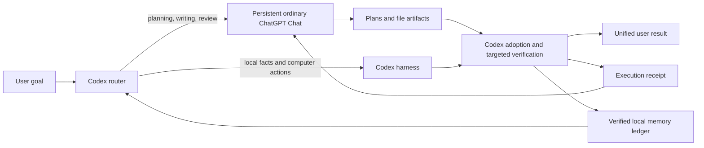

# Codex Bridge to ChatGPT v0.4 Functional Design

## Status

This document defines the next functional target. The v0.3 code remains the implementation baseline. No live ChatGPT transport test should start until the v0.4 contracts and lifecycle below are implemented and locally validated.

## Product outcome

One ordinary ChatGPT Chat acts as the persistent language workspace for an effort. It keeps semantic continuity and performs planning, reasoning, review, prose, and file authorship. Codex keeps the authoritative view of the computer, repository, applications, permissions, and verification results.

The user gives one goal. The bridge chooses where each part runs, synchronizes only useful changes, and presents one coherent result rather than making the user relay messages between ChatGPT and Codex.

## Default user experience

1. The user asks Codex to bind an existing ordinary ChatGPT Chat once.
2. The user gives a normal task without manually splitting it.
3. Codex briefly states the route when delegation materially changes where data goes.
4. ChatGPT uses its existing context to plan, write, review, or produce files.
5. Codex imports the result, performs targeted verification and any required computer work, then reports one combined outcome.
6. Codex sends the verified receipt back to the same Chat automatically within the bound goal.
7. A later Codex task in the same workspace resumes from local state and the same Chat rather than starting a new bridge.

The routine path should require no copy-and-paste and no repeated confirmation. Status, pause, routing overrides, checkpoint, and migration remain available in natural language.



## Functional principles

1. Preserve useful context without assuming Chat history is permanent or perfectly recalled.
2. Spend Codex work on capabilities that require its harness: local inspection, tools, edits, tests, computer control, and external actions.
3. Let ChatGPT author real files and substantial text rather than limiting it to recommendations.
4. Never let remote output become local authority merely because it is well formed.
5. Make every handoff resumable, idempotent, inspectable, and attributable to one workspace and one Chat.
6. Give the user simple controls without requiring them to understand the transport or protocol.

## Responsibility model

| Work | Default owner | Reason |
|---|---|---|
| Goal clarification and decomposition | ChatGPT | Text-heavy and benefits from continuing context |
| Architecture and trade-off analysis | ChatGPT | High reasoning value without direct computer access |
| Prose, documentation, plans, and reports | ChatGPT | Can author complete artifacts |
| Source-file drafting from supplied evidence | ChatGPT | Produces substantial file content efficiently |
| Repository search and current-state facts | Codex | Requires the live workspace |
| File placement, conflict resolution, and atomic writes | Codex | Requires filesystem authority |
| Commands, tests, browser actions, and desktop control | Codex | Requires the harness |
| Approval-sensitive or external actions | Codex | Must use current user authorization |
| Final correctness and completion decision | Codex | Must be based on observed results |

The user can override routing for any step. An override changes ownership for that step and does not permanently rewrite the default policy.

## Routing engine

The bridge classifies each unit of work on four axes:

- `computer_dependency`: Does it require current files, commands, applications, credentials, or UI state?
- `context_value`: Does the continuing Chat history materially improve the result?
- `output_weight`: Will the step produce substantial text or one or more files?
- `verification_need`: Can Codex cheaply verify the result after ChatGPT produces it?

Routing decisions:

| Condition | Route |
|---|---|
| High computer dependency | Codex |
| Low computer dependency and high context value | ChatGPT |
| Large text/file output with cheap local verification | ChatGPT then Codex |
| Ambiguous design followed by local implementation | ChatGPT then Codex |
| Pure local lookup or mechanical edit | Codex |
| Sensitive context that cannot be minimized | Codex unless the user explicitly authorizes transmission |

The bridge records a short routing reason in the round metadata. It must not duplicate ChatGPT's full reasoning in Codex merely to justify delegation.

User overrides are expressed naturally, for example “这一段交给 Chat”, “只在本地做”, or “Chat 起草，Codex 验证”. The Skill should understand these as `chat`, `codex`, or `hybrid` overrides.

## Session model

### Workspace identity

Each bridge is bound to one workspace fingerprint:

- canonical workspace root;
- repository remote when present;
- current worktree identity;
- initial branch and commit;
- optional user-supplied project label.

Branch and commit changes do not automatically create a new bridge, but they invalidate affected local facts. Moving to an unrelated repository requires a separate bridge.

The bridge state belongs to the workspace rather than one Codex transcript. A newly opened Codex task may resume it after validating the workspace fingerprint, in-flight state, latest completed receipt, and Chat identity.

### Chat identity

The state stores:

- stable app Chat ID when available;
- visible title;
- transport type;
- account/workspace evidence summary;
- first and last successful round;
- previous Chat identities after migration.

The bridge never silently switches Chats. If the stored Chat cannot be reached, it enters `RECOVERY_REQUIRED`.

### Lifecycle commands

The user should be able to request these operations in natural language:

| Operation | Behavior |
|---|---|
| Bind | Select an existing ordinary Chat and create bridge state |
| Status | Show Chat identity, round, checkpoint age, pending work, and transport |
| Pause | Finish or abort the current round and stop automatic delegation |
| Resume | Validate state and continue from the latest receipt |
| Checkpoint | Refresh durable memory without doing implementation work |
| Migrate | Bootstrap a user-selected replacement Chat from a verified checkpoint |
| Unbind | Stop using the Chat while retaining local history |
| Forget | Delete bridge runtime data only after explicit user authorization |

## Authorization lifecycle

Binding a Chat for a named goal authorizes routine, minimized bridge messages for that goal until the user pauses or unbinds it. The bridge should not ask for confirmation on every ordinary planning, drafting, review, or execution-receipt message.

This continuing authorization does not cover:

- data classified as Sensitive;
- a different project or unrelated goal;
- destructive actions;
- messages or publications to third parties;
- deployment, push, purchase, credential, or account changes;
- browser automation before its versioned risk acknowledgement.

When scope expands, the bridge records the new goal boundary and obtains user input only when the new work is outside existing authorization.

## Context architecture

### Layer 1: Chat semantic context

The designated Chat retains discussion style, explanations, drafts, rejected ideas, and long-form reasoning. This layer is efficient but not authoritative and may be compacted by the product.

### Layer 2: verified memory ledger

The local checkpoint stores structured entries instead of one opaque summary:

```json
{
  "id": "decision-17",
  "kind": "decision",
  "scope": "workspace",
  "value": "Use append-only JSONL lifecycle events",
  "status": "accepted",
  "source_round": 4,
  "verified_by": "codex",
  "verified_against": ["skills/.../context-state.mjs"],
  "validity": "durable"
}
```

Entry kinds are `goal`, `acceptance`, `decision`, `invariant`, `preference`, `term`, `local_fact`, `artifact`, and `open_question`.

`local_fact` entries must carry freshness data. A change to the referenced file, branch, commit, command environment, or application state invalidates the entry. Durable decisions and user preferences do not expire merely because files changed.

### Layer 3: immutable exchanges

Each round stores the exact request, result, adoption decision, execution receipt, and hashes. Exchange history is evidence and recovery material; it is not resent by default.

### Delta construction

Every request contains:

- current objective for the round;
- user intent added since the previous receipt;
- invalidated or newly verified local facts;
- accepted, rejected, and deferred outcomes from the previous round;
- relevant checkpoint digest;
- requested deliverables;
- explicit questions ChatGPT should answer.

The bridge omits unchanged history. It may include a small excerpt only when exact syntax or wording changes the outcome.

### Context compaction

A checkpoint refresh occurs when any of these is true:

- five rounds completed since the last checkpoint;
- the user changes scope or acceptance criteria;
- the branch or worktree changes materially;
- the Chat begins contradicting accepted durable memory;
- the Chat is about to be migrated;
- the serialized verified ledger exceeds the configured size target.

ChatGPT may propose a compacted memory, but Codex merges only accepted decisions and locally verified facts.

## Round protocol

Each round has an idempotency key formed from `bridge_id`, `round`, and request hash.

```text
READY
  -> PREPARING
  -> AWAITING_SEND
  -> AWAITING_RESULT
  -> VALIDATING
  -> ADOPTING
  -> EXECUTING
  -> REPORTING
  -> CHECKPOINTING (when required)
  -> READY
```

Terminal side states are `PAUSED`, `RECOVERY_REQUIRED`, and `BLOCKED_BY_USER_ACTION`. A failed round becomes `ABORTED`; a round invalidated by new user direction becomes `SUPERSEDED`. Their numbers and idempotency keys are never reused.

Only one mutation round may execute at a time. Read-only planning rounds may be queued but must not update the checkpoint out of order. Results arriving out of order remain pending until all earlier checkpoint-affecting rounds are resolved.

## Chat response profiles

The request declares one response profile:

| Profile | Expected result |
|---|---|
| `plan` | Decisions, sequence, risks, and evidence requests |
| `artifact` | One or more complete files or attachments plus artifact manifest |
| `review` | Findings with severity, evidence, and proposed resolution |
| `diagnosis` | Ranked hypotheses and discriminating local checks |
| `checkpoint` | Proposed compacted memory entries |

The bridge asks for concise structured output. ChatGPT should not repeat the whole prompt, narrate generic methodology, or fabricate repository access.

## Artifact pipeline

### Manifest

Every Chat-authored file has:

```json
{
  "artifact_id": "artifact-8",
  "path": "docs/design.md",
  "media_type": "text/markdown",
  "encoding": "utf-8",
  "operation": "create",
  "delivery": "attachment",
  "attachment_name": "design.md",
  "base_sha256": null,
  "declared_sha256": null,
  "size": 18342
}
```

Supported operations are `create`, `replace`, `merge`, and `suggest`. `replace` and `merge` require `base_sha256` when a target already exists. Codex rejects stale-base writes and asks ChatGPT to regenerate from a fresh delta.

### Text files

ChatGPT may deliver a complete inline file or an attachment. Complete-file delivery is preferred over a raw patch because it is easier to inspect, hash, and recover. Codex normalizes line endings only when the repository policy requires it.

### Binary and large files

Binary and large artifacts must use attachments. Codex computes the actual hash and media type after acquisition. A declared hash is advisory until locally verified.

### Placement and conflicts

Codex validates that every path:

- is relative to an authorized workspace root;
- does not traverse outside it;
- does not target protected bridge, Git, credential, or dependency-cache locations;
- respects the active worktree and repository instructions.

Writes are staged in a temporary sibling file and atomically renamed when supported. Existing user changes are preserved. A base-hash mismatch creates a conflict result rather than overwriting the file.

## Feedback loop

After adoption and local execution, Codex sends an execution receipt to the same Chat. The receipt contains outcomes rather than raw logs:

- adopted, rejected, and deferred recommendations;
- artifact hashes and final paths;
- checks run and summarized results;
- deviations from the proposed implementation;
- newly verified facts;
- unresolved failures and the next focused question.

For fix-and-test work, the default maximum is three Chat-to-Codex implementation rounds. The bridge stops earlier when acceptance passes, progress stalls, the same failure repeats, or new authorization is required. The user may extend the loop explicitly.

## Verification tiers

Codex should verify enough to establish the requested outcome without reproducing ChatGPT's full drafting or reasoning work.

| Artifact or decision | Default verification |
|---|---|
| Ordinary prose | Contract, requested coverage, obvious factual conflicts, and file integrity |
| Structured document or configuration | Schema or parser validation and relevant local references |
| Source code | Base hash, repository rules, compilation or focused tests, and changed behavior |
| Security, credentials, deployment, or destructive proposal | Full local evidence and current authorization before action |
| Pure planning | Consistency with verified constraints; no implementation replay |

If verification would cost more than performing a small task locally, the router should keep that task in Codex rather than delegate it.

## Questions and human input

When ChatGPT asks a question, Codex first checks whether the answer is available from authorized local evidence. It answers locally verifiable questions itself and records the evidence. Questions about product intent, preferences, credentials, policy choices, or external side effects go to the user.

The bridge batches related user questions into one interruption when possible. It preserves the active round while waiting and resumes rather than starting over.

## Mid-round steering and cancellation

New user input normally updates the active goal. If it is compatible with the request already sent, queue it as the next delta. If it invalidates the active objective, acceptance criteria, privacy boundary, or requested artifact, mark the round `SUPERSEDED` and never adopt its result automatically.

A late result from a superseded round remains in exchange history for inspection. It cannot update the checkpoint or write files. The next round cites the superseding user instruction and receives a new idempotency key.

## Transport abstraction

### App coordination adapter

Preferred capabilities:

- list ordinary ChatGPT Chats;
- verify Chat identity and backing kind;
- send a follow-up to the stored Chat;
- wait for completion or required attention;
- read the result and acquire returned artifacts.

This adapter uses product-provided app coordination tools. It does not require browser-risk consent.

### Visible browser adapter

The fallback retains the upstream versioned risk acknowledgement and visible-control constraints. It performs one send and one response copy per round, stops on ambiguity, and never accesses private endpoints or hidden authentication data.

### Capability negotiation

Before binding, the bridge records which features the selected transport actually supports: persistent Chat ID, wait, structured result retrieval, attachment acquisition, model-label observation, and user takeover. Unsupported features degrade explicitly; they are never assumed.

## Privacy and disclosure

Each outbound item is assigned one class:

| Class | Default behavior |
|---|---|
| Public | Send when relevant |
| Project | Send minimized excerpts or summaries |
| Sensitive | Require action-time user authorization naming the destination |
| Secret | Never send |

Path allowlists and ignore rules reduce accidental disclosure. Regex secret scanning is only one layer; Codex also performs semantic review. Persistent exchange files inherit the sensitivity of their contents and remain untracked by default.

## Observability

`Status` reports:

- bound Chat title and verified identity status;
- transport and supported capabilities;
- current state and round;
- last successful exchange and checkpoint age;
- pending artifacts or user questions;
- files and checks from the latest receipt;
- optional estimated Codex work avoided, clearly labeled as an estimate rather than a billing fact.

Verbose raw prompts and responses are read from exchange files only when the user requests inspection.

## Failure behavior

| Failure | Required behavior |
|---|---|
| Ambiguous send | Abort round; never resend with the same key |
| Invalid response | One repair turn on app transport; abort immediately on browser transport |
| Wrong Chat or account | Enter `RECOVERY_REQUIRED` |
| Model unavailable | Ask the user; never substitute silently |
| Rate limit or unusual activity | Stop; do not work around it |
| Deleted or inaccessible Chat | Recover from checkpoint into a user-selected replacement |
| Base-hash conflict | Preserve both versions and request a refreshed artifact |
| Attachment unavailable | Keep manifest pending; do not claim the file was applied |
| Repeated implementation failure | Stop after the configured loop bound and report evidence |
| Corrupt local state | Reconstruct from journal and immutable exchanges when possible |

## Configuration

Project-local configuration may specify:

- automatic routing enabled or paused;
- preferred Chat title or stored Chat ID;
- allowed workspace roots and path patterns;
- ignored and secret paths;
- checkpoint frequency and size target;
- maximum implementation rounds;
- permitted response profiles;
- artifact size limit;
- whether optional savings estimates are recorded.

Credentials, cookies, authentication headers, and browser storage never belong in bridge configuration.

## v0.4 acceptance criteria

The design is implemented when all of the following are observable locally:

1. A bridge binds to one ordinary Chat and refuses silent Chat replacement.
2. Routing covers Chat, Codex, and hybrid steps with recorded reasons and user overrides.
3. Later requests contain deltas anchored to the last receipt and checkpoint digest.
4. Structured memory entries invalidate stale local facts when workspace state changes.
5. Artifact manifests support inline and attachment delivery, base hashes, conflicts, and atomic placement.
6. Every completed round has request, result, adoption, execution receipt, and lifecycle records.
7. Checkpoint migration restores durable context without replaying the transcript.
8. Questions route to Codex evidence or the user according to their type.
9. App and browser adapters declare capabilities and fail closed when a required capability is absent.
10. Existing one-shot handoff behavior remains compatible.
11. Compatible steering queues a new delta, while incompatible steering supersedes the active round without adopting its late result.
12. Verification tiers avoid repeating ChatGPT's full work when a cheaper targeted check establishes correctness.

## Deliberately deferred

- Multiple ChatGPT accounts in one bridge.
- Multiple simultaneous mutation rounds.
- Headless or background ChatGPT Web automation.
- Private ChatGPT endpoints, browser credential extraction, or anti-detection behavior.
- Automatic publication, deployment, push, or other external side effects.
- Claims of guaranteed quota separation or exact savings.

## Implementation sequence after design approval

1. Upgrade persistent state and contracts to schema v2.
2. Implement routing records, workspace fingerprints, and memory invalidation.
3. Implement artifact manifest acquisition and base-hash conflict handling.
4. Add adapter capability records and app-coordination workflow instructions.
5. Add lifecycle commands, status output, pause/resume, and journal recovery.
6. Add deterministic contract and state-transition tests.
7. Only then run the first real ordinary-Chat end-to-end test.
